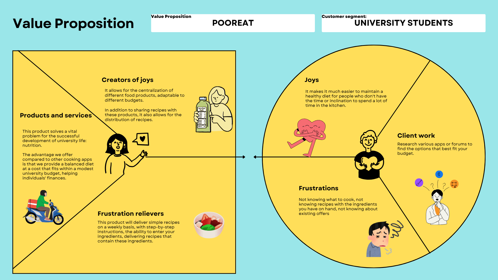
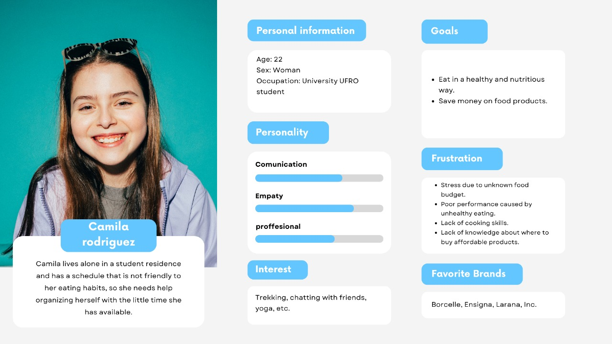
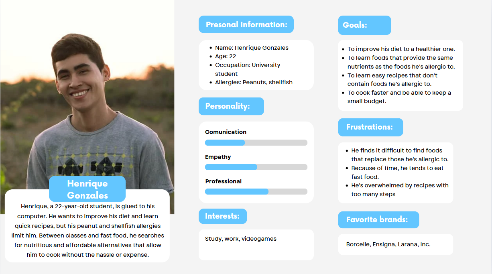
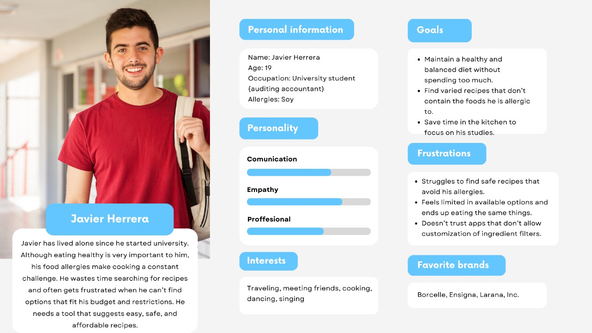
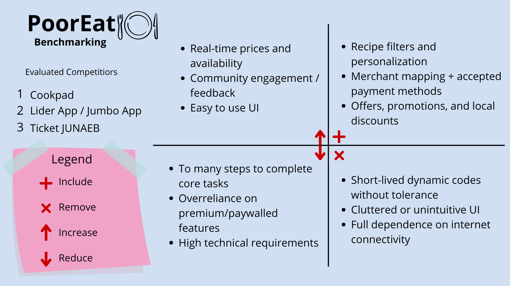
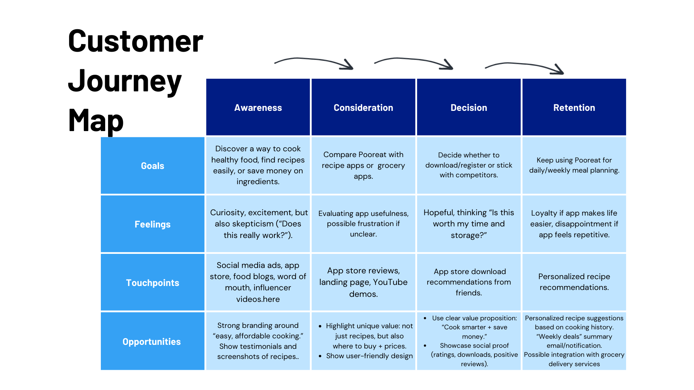
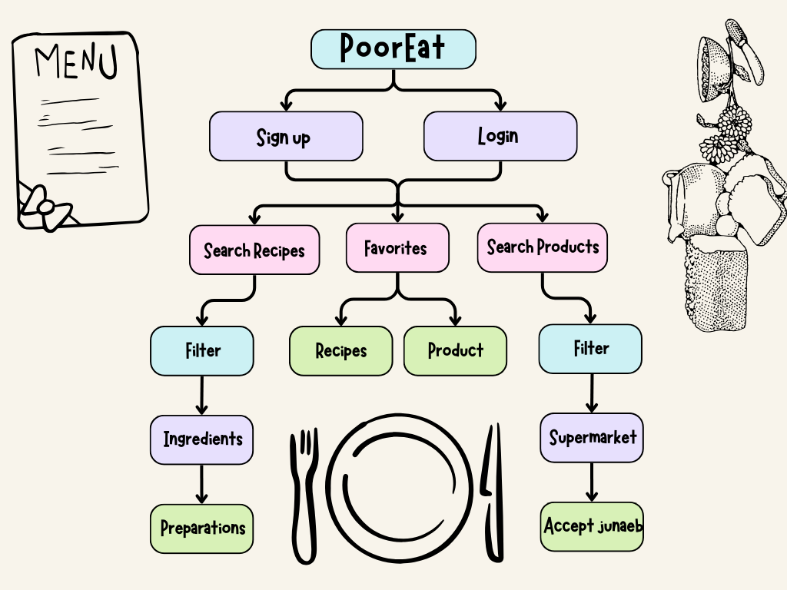

# ThriftyChef (ex PoorEat)

Pooreat centralizes the cooking and shopping experience, helping users organize their meals and expenses in one place.

Link repository Figma:
https://www.figma.com/design/rxNYEHFWvhtoeY0380oCaw/Prototipado?node-id=0-1&t=9mrSOadL0mFG1qtD-1

Link navigable prototype:
https://www.figma.com/proto/rxNYEHFWvhtoeY0380oCaw/Prototipado?node-id=57-1036&p=f&t=x9NzR4WKN7qkjPii-0&scaling=scale-down&content-scaling=fixed&page-id=57%3A1035

---

## Index

1. [Team](#1-team)
2. [Overview](#2-overview)
3. [Problem](#3-problem)
4. [Main Features](#4-main-features)
5. [How to use the app](#5-how-to-use-the-app)

    * [Search recipes](#search-recipes)
    * [View ingredients](#view-ingredients)
    * [Check establishments and prices](#check-establishments-and-prices)
    * [Establishments with JUNAEB benefits](#establishments-with-junaeb-benefits)
    
6. [Strategy](#6-strategy)

    * [6.1 Value Proposition Canvas](#61-value-proposition-canvas)
    * [6.2 UX Persona](#62-ux-persona)
    * [6.3 Benchmarking](#63-benchmarking)
    
7. [Scope](#7-scope)

    * [7.1 Customer Journey Map](#71-customer-journey-map)
    
8. [Stucture](#8-stucture)

    * [8.1 Navigation Flow](#81-navigation-flow)
    
9. [Skeleton](#9-skeleton)

    * [9.1 Low-Fi Wireframes](#91-low-fi-wireframes)
  
10. [Surface](#10-Surface)

    * [10.1 High Definition Interfaces](#101-High-Definition-Interfaces)
   
    * [10.2 Final High Definition Interfaces](#102-Final-High-Definition-Interfaces)
   
11. [heuristic evaluation](#11-heuristic-evaluation)

12. [Accessibility topics](#12-Accessibility-topics)

---

## 1. Team

* [Hector Chavez] -> UX Designer
* [Christian Muñoz] -> Project Manager
* [Francisco Ceballos] -> UX Designer
* [Esteban Cancino] -> UX Researcher

---

## 2. Overview

**ThriftyChef** is an app designed to make it easy and accessible to search for and prepare recipes. The app not only allows you to explore a wide variety of recipes with detailed ingredients, but also offers practical information on where to purchase them, showing nearby establishments, updated prices, and availability.

An added value of **ThriftyChef** is that it helps students and users with the **JUNAEB** benefit by indicating which establishments accept this payment method. In this way, it not only promotes healthy and varied eating but also optimizes the budget and time of those who use the app.

---

## 3. Problem

Meal planning and managing the food budget represent a significant challenge for university students. This group, often operating with limited income and little free time, faces a series of frictions that **PoorEat** aims to solve:

1. **Uncontrolled Spending and Price Ignorance:** Students often purchase items without a clear price reference, leading to **inefficient spending**. There is no single tool that links a recipe to its **estimated total cost** and the **current price** of its ingredients at nearby establishments.

2. **Fragmentation of the Cooking and Shopping Process:** The current process is tedious:
    * Search for a recipe (Site A).
    * Manually create a shopping list (paper or App B).
    * Visit multiple stores to compare prices (manual process).
    * Verify if a store accepts the **JUNAEB** benefit (App C or trial and error).
    * This fragmentation leads to **wasted time and stress**.

3. **Limited Access to Affordable and Healthy Options:** Many university students resort to fast food or repetitive, low-nutrient meals due to the **perception that cooking is expensive or complicated**. There is a lack of recipes focused on **economy** and **efficiency** (minimal leftovers, low-cost ingredients).

4. **Lack of Awareness of Student Benefits:** Despite having the **JUNAEB** benefit, students waste time actively searching for which establishments accept it, limiting their ability to **maximize their scholarship** when buying ingredients for home cooking.

---

## 4. Main Features

* Search for recipes with detailed ingredients.
* View nearby establishments with availability and prices.
* Identify establishments that accept JUNAEB payments.
* User-friendly and intuitive interface for a better user experience.

---

## 5. How to use the app

### Search recipes

Browse the catalog of available recipes by category or ingredients.

### View ingredients

Each recipe shows the required ingredients, along with quantities and preparation instructions.

### Check establishments and prices

The app lists nearby establishments, along with prices and availability for each product.

### Establishments with JUNAEB benefits

Establishments that support **JUNAEB** are prominently displayed.

---

## 6. Strategy

### 6.1 Value Proposition Canvas

### 6.2 UX Persona

### 6.3 Benchmarking

---

## 7. Scope

### 7.1 Customer Journey Map

---

## 8. Stucture

### 8.1 Navigation Flow

---

## 9. Skeleton

### 9.1 Low-Fi Wireframes

[View Wireframes](docs/Wireframes-PoorEat.pdf)

---

## 10. Surface

### 10.1 High Definition Interfaces

[View Mockups](docs/Mockups.pdf)

### 10.2 Final High Definition Interfaces

[View Final Interfaces](docs/Final-Interfaces.pdf)

---

## 11. heuristic evaluation

[View heuristic evaluation](docs/POOREAT-(evalución-hecha-por-PETCONNECT).pdf)

---

## 12. Accessibility topics

[View Accessibility topics](docs/Temáticas-de-accesibilidad.pdf)
